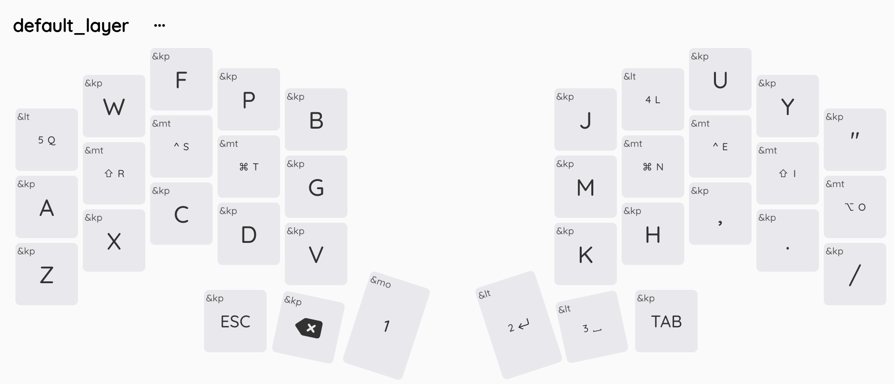

# Corne ZMK Configuration

This repository contains my personal ZMK firmware configuration for the Corne36-key split keyboard, featuring a Colemak-DH layout optimized for comfort and efficiency.

## Keyboard Setup

I use two keyboards alternately, both configured with similar Colemak-DH layouts:
- **Corne (36-key)**: ZMK firmware configuration (this repository)
- **Chocofi (36-key)**: ZMK firmware configuration (this repository)
- **ZSA Voyager (52-key)**: QMK firmware via [Oryx configurator](https://configure.zsa.io/voyager/layouts/XeqG6/latest/0)

All the keyboards share the same base Colemak-DH layout and home row modifier philosophy for consistent muscle memory across devices.

## Layout Overview

### Visual Layout

*Layout as rendered by ZMK keymap editors using the info.json configuration*

### Base Layer (Colemak-DH)
```
 Q   W   F   P   B     J   L   U   Y   "
 A   R   S   T   G     M   N   E   I   O
 Z   X   C   D   V     K   H   ,   .   /
   ESC BSPC 1   ENT  SPC TAB
```

The base layer uses the Colemak-DH layout, which places the most common letters on the home row and optimizes finger movement patterns. Home row modifiers are implemented:
- Left hand: A (none), R (Shift), S (Ctrl), T (Cmd)
- Right hand: N (Cmd), E (Ctrl), I (Shift), O (Alt)
- Q key: Hold for layer 5, tap for 'Q'
- L key: Hold for layer 4 (COMBO), tap for 'L'  
- ENTER key: Hold for layer 2 (NAV), tap for Enter
- SPACE key: Hold for layer 3 (NUM), tap for Space

### Symbol Layer (SYM)
Accessed via layer 1 (hold the "1" thumb key), this layer provides symbols and special characters:
```
     %   +   |   )     (   &   `   $   ;
 @   !   :   =   }     {   -   -   #   '
ESC  \   ^   ~   ]     [   ?   *   <   >
```

### Navigation Layer (NAV)
Accessed via layer 2 (hold ENTER), featuring navigation controls:
```
                         PGUP PGDN              
                       LEFT DOWN   UP   RIGHT
                       C+LF C+R→  C+S+TAB C+TAB
   C+SP                              
```

Navigation shortcuts: Ctrl+Left, Ctrl+Right, Ctrl+Shift+Tab, Ctrl+Tab

### Number Layer (NUM)
Accessed via layer 3 (hold SPACE), provides a number pad layout:
```
                        1   2   3   BS  
                        4   5   6   0   
                    .   7   8   9   /
```

### Combo Layer (COMBO)
Accessed via layer 4 (hold L), provides shortcuts and system controls:
```
C+Cmd+Q       S+Cmd+F  S+Cmd+P  C+-         Cmd+`  C+`     
             Cmd+-    Cmd++              S+Cmd+4 Cmd+F5  Cmd+F12
                                S+Cmd+V                    
```

### Bluetooth Layer (BT)
Layer for Bluetooth device management:
```
                    BT_CLR   BT_PRV BT_NXT      
                                         
                             BT_0   BT_1   BT_2
```

## Key Features

- **Home Row Modifiers**: All modifier keys are accessible without leaving the home row
- **Layer Taps**: Dual-function keys that act as layers when held, regular keys when tapped
- **Combo Layer**: Advanced shortcuts accessed by holding L
- **Bluetooth Control**: Easy device switching via combo layer
- **Ergonomic Design**: Optimized for 36-key split keyboard ergonomics
- **Colemak-DH**: Modern layout designed for English typing efficiency

## Hardware Setup

### Prospector Dongle with YADS Display

This configuration uses a **Prospector dongle** as the central device with the **YADS (Yet Another Dongle Screen)** firmware for the color LCD display.

**Components:**
- **Dongle**: XIAO BLE with Prospector (Waveshare 1.69" round LCD)
- **Left/Right halves**: nice!nano v2 (both as peripherals, no OLEDs)

**Firmware Stack:**
- ZMK main branch (Zephyr 4.1)
- YADS upgrade-4.1 branch
- ZMK Studio enabled

### Firmware Files

After GitHub Actions builds complete, download these files:
- `xiao_corne_dongle_yads.uf2` - Flash to Prospector dongle
- `nice_corne_left_peripheral.uf2` - Flash to left half
- `nice_corne_right_peripheral.uf2` - Flash to right half

### Flashing Procedure

1. **Flash settings_reset first** on all three devices to clear pairing data
2. **Flash the dongle** with `xiao_corne_dongle_yads.uf2`
3. **Flash the left half** with `nice_corne_left_peripheral.uf2`
4. **Flash the right half** with `nice_corne_right_peripheral.uf2`

### Pairing Order (Important!)

After flashing, pair devices in this exact order for correct battery display:
1. **Left half first** - Power on and let it pair with dongle
2. **Right half second** - Power on and let it pair with dongle

### ZMK Studio

This firmware has **ZMK Studio** enabled, allowing you to modify your keymap in real-time without reflashing:
1. Connect the dongle via USB
2. Visit [ZMK Studio](https://zmk.studio)
3. Pair with your keyboard
4. Edit layers, bindings, and behaviors live

### YADS Display Controls

The YADS display can be controlled via F22-F24 keys (extended function keys in USB HID spec):
- **F22**: Toggle display on/off
- **F23**: Decrease brightness
- **F24**: Increase brightness

These are mapped on **Layer 5 (BT layer)**: Hold Q, then press L/U/Y positions.

### YADS Display Features

- Words per minute (WPM) counter
- Active layer indicator
- Modifier key status
- Connection status (USB/BLE)
- Battery levels for both halves
- Auto-brightness via ambient light sensor

## Building

This configuration is designed to work with ZMK's build system. Push changes to GitHub and the Actions workflow will automatically build firmware files.
